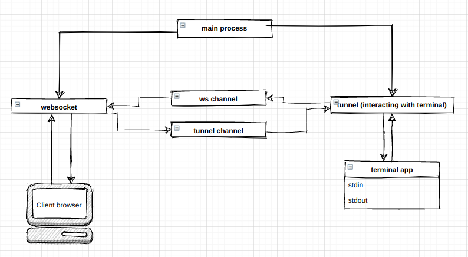

# Code Anime!
convert your code into visual algorigthm

## alert
this project is under developments

## idea / algorithm:
TODO: use macros

----------
## app diagram:

----------

## keywords:
1. **!show** var1 [, var2, var3]
2. **!sleep** (time in ms)
3. **!forget** var1 [, var2, var3]
4. ...

----------

## how to use it:
obviously you can't use it now because it's under development